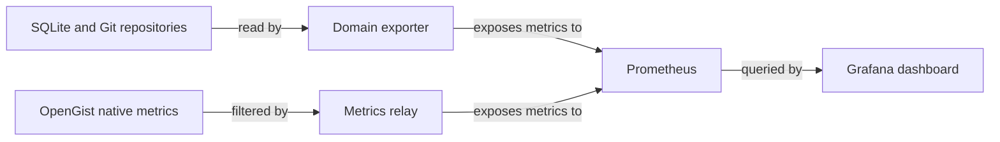

# Architecture

This project connects its data source to its Grafana dashboard through the components shown below.

## Overview

This diagram shows the data path for this project.



## Components

### Data source

OpenGist SQLite and bare Git repositories -> read-only exporter; native metrics -> filtered relay; authenticated /metrics -> Prometheus -> Grafana.

### Dashboard

`dashboards/opengist-application.json` contains the Grafana dashboard definition.

## Data flow

OpenGist SQLite and bare Git repositories -> read-only exporter; native metrics -> filtered relay; authenticated /metrics -> Prometheus -> Grafana. Grafana evaluates dashboard queries against the selected data source and label values.

## Directory layout

```text
.
├── dashboards/  Grafana dashboard JSON files
├── src/  Python services and collectors
├── tests/  Automated unit tests
├── examples/  Scrape and deployment examples
├── docs/        Documentation source
└── README.md    Project overview and quick links
```
